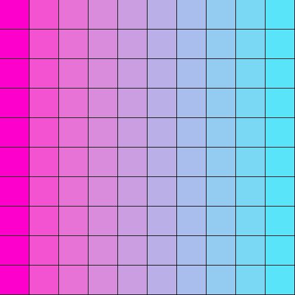

# rs-wall

## Basic wallpaper generation binary in Rust

### The work is currently in progress, will keep on adding features to make a reaaly cool wallpaper geenration tool. Cuurently it does only this.

